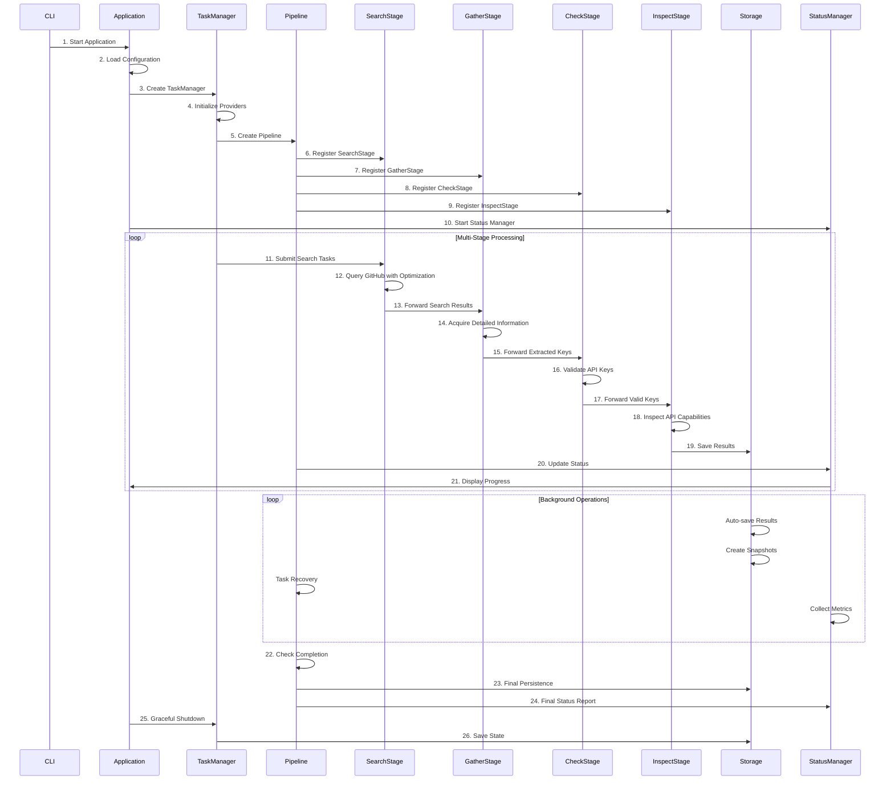

# Harvester - Universal Data Acquisition Framework

**📖 [中文文档](README.zh-CN.md) | English | 🔗 [More Tools](https://github.com/wzdnzd/ai-collector)**

A universal, adaptive data acquisition framework designed for comprehensive information acquisition from multiple sources including GitHub, network mapping platforms (FOFA, Shodan), and arbitrary web endpoints. While the current implementation focuses on AI service provider key discovery as a practical example, the framework is architected for extensibility to support diverse data acquisition scenarios.

---

⭐⭐⭐ **If this project helps you, please give it a star!** Your support motivates us to keep improving and adding new features.

---

## Table of Contents

- [Key Features](#key-features)
- [Quick Start](#quick-start)
- [Architecture](#architecture)
- [Directory Structure](#directory-structure)
- [Troubleshooting](#troubleshooting)
- [Contributing](#contributing)

## Project Goals

The system aims to build a **universal data acquisition framework** primarily targeting:

- **GitHub**: Code repositories, issues, commits, and API endpoints
- **Network Mapping Platforms**: 
  - [FOFA](https://fofa.info) - Cyberspace mapping and asset discovery
  - [Shodan](https://www.shodan.io/) - Internet-connected device search engine
- **Arbitrary Web Endpoints**: Custom APIs, web services, and data sources
- **Extensible Architecture**: Plugin-based system for easy integration of new data sources

## Current Data Source Support

| Data Source | Status        | Description                             |
| ----------- | ------------- | --------------------------------------- |
| GitHub API  | ✅ Implemented | Full API integration with rate limiting |
| GitHub Web  | ✅ Implemented | Web scraping with intelligent parsing   |
| FOFA        | 🚧 Planned     | Cyberspace asset discovery integration  |
| Shodan      | 🚧 Planned     | IoT and network device enumeration      |
| Custom APIs | 🚧 Planned     | Generic REST/GraphQL API adapter        |

## Architecture

### Layered Architecture

```mermaid
graph TB
    %% Entry Layer
    subgraph Entry["Entry Layer"]
        CLI["CLI Interface<br/>(main.py)"]
        App["Application Core<br/>(main.py)"]
    end

    %% Management Layer
    subgraph Management["Management Layer"]
        TaskMgr["Task Manager<br/>(manager/task.py)"]
        Pipeline["Pipeline Manager<br/>(manager/pipeline.py)"]
        WorkerMgr["Worker Manager<br/>(manager/worker.py)"]
        QueueMgr["Queue Manager<br/>(manager/queue.py)"]
        StatusMgr["Status Manager<br/>(manager/status.py)"]
        Shutdown["Shutdown Coordinator<br/>(manager/shutdown.py)"]
    end

    %% Processing Layer
    subgraph Processing["Processing Layer"]
        StageBase["Stage Framework<br/>(stage/base.py)"]
        StageImpl["Stage Implementations<br/>(stage/definition.py)"]
        StageReg["Stage Registry<br/>(stage/registry.py)"]
        StageFactory["Stage Factory<br/>(stage/factory.py)"]
        StageResolver["Dependency Resolver<br/>(stage/resolver.py)"]
    end

    %% Service Layer
    subgraph Service["Service Layer"]
        SearchSvc["Search Service<br/>(search/client.py)"]
        SearchProviders["Search Providers<br/>(search/provider/)"]
        RefineSvc["Query Refinement<br/>(refine/)"]
        RefineEngine["Refine Engine<br/>(refine/engine.py)"]
        RefineOptimizer["Query Optimizer<br/>(refine/optimizer.py)"]
    end

    %% Core Domain Layer
    subgraph Core["Core Domain Layer"]
        Models["Domain Models & Tasks<br/>(core/models.py)"]
        Types["Type System<br/>(core/types.py)"]
        Enums["Enumerations<br/>(core/enums.py)"]
        Metrics["Metrics<br/>(core/metrics.py)"]
        Auth["Authentication<br/>(core/auth.py)"]
    end

    %% Infrastructure Layer
    subgraph Infrastructure["Infrastructure Layer"]
        Config["Configuration<br/>(config/)"]
        Tools["Tools & Utilities<br/>(tools/)"]
        Constants["Constants<br/>(constant/)"]
        Storage["Storage & Persistence<br/>(storage/)"]
    end

    %% State Management Layer
    subgraph StateLayer["State Management Layer"]
        StateCollector["State Collector<br/>(state/collector.py)"]
        StateDisplay["Display Engine<br/>(state/display.py)"]
        StateBuilder["Status Builder<br/>(state/builder.py)"]
        StateModels["State Models<br/>(state/models.py)"]
        StateMonitor["State Monitor<br/>(state/monitor.py)"]
        StateEnums["State Enums<br/>(state/enums.py)"]
        StateTypes["State Types<br/>(state/types.py)"]
    end

    %% External Systems
    subgraph External["External Systems"]
        GitHub["GitHub<br/>(API + Web)"]
        AIServices["AI Service<br/>Providers"]
        FileSystem["File System<br/>(Local Storage)"]
    end

    %% Dependencies (Top-down)
    Entry --> Management
    Management --> Processing
    Processing --> Service
    Service --> Core

    %% Infrastructure dependencies
    Entry -.-> Infrastructure
    Management -.-> Infrastructure
    Processing -.-> Infrastructure
    Service -.-> Infrastructure
    Core -.-> Infrastructure

    %% State management dependencies
    Entry -.-> StateLayer
    Management -.-> StateLayer

    %% External dependencies
    Service --> External
    Infrastructure --> External
```



### System Architecture Overview

```mermaid
graph TB
    %% User Interface Layer
    subgraph UserLayer["User Interface Layer"]
        User[User]
        CLI[Command Line Interface]
        ConfigMgmt[Configuration Management]
    end

    %% Application Management Layer
    subgraph AppLayer["Application Management Layer"]
        MainApp[Main Application]
        TaskManager[Task Manager]
        StatusManager[Status Manager]
        ResourceManager[Resource Manager]
        ShutdownManager[Shutdown Manager]
    end

    %% Core Pipeline Engine
    subgraph PipelineCore["Pipeline Engine"]
        %% Stage Management System
        subgraph StageSystem["Stage Management System"]
            StageRegistry[Stage Registry]
            DependencyResolver[Dependency Resolver]
            StageFactory[Stage Factory]
        end

        %% Queue Management System
        subgraph QueueSystem["Queue Management System"]
            QueueManager[Queue Manager]
            WorkerManager[Worker Manager]
            MonitoringSystem[System Monitor]
        end

        %% Processing Stages
        subgraph ProcessingStages["Processing Stages"]
            SearchStage[Search Stage]
            GatherStage[Gather Stage]
            CheckStage[Check Stage]
            InspectStage[Inspect Stage]
        end
    end

    %% Search Provider Ecosystem
    subgraph ProviderEcosystem["Search Provider Ecosystem"]
        ProviderRegistry[Provider Registry]
        BaseProvider[Base Provider]
        OpenAIProvider[OpenAI-like Provider]
        CustomProviders[Custom Providers]
    end

    %% Advanced Processing Engines
    subgraph ProcessingEngines["Processing Engines"]
        SearchClient[Search Client]

        %% Query Optimization Engine
        subgraph QueryOptimizer["Query Optimization Engine"]
            RefineEngine[Refine Engine]
            RegexParser[Regex Parser]
            SplittabilityAnalyzer[Splittability Analyzer]
            EnumerationOptimizer[Enumeration Optimizer]
            QueryGenerator[Query Generator]
            OptimizationStrategies[Optimization Strategies]

            %% Internal Flow
            RefineEngine --> RegexParser
            RegexParser --> SplittabilityAnalyzer
            SplittabilityAnalyzer --> EnumerationOptimizer
            EnumerationOptimizer --> OptimizationStrategies
            OptimizationStrategies --> QueryGenerator
        end

        ValidationEngine[API Key Validation]
        RecoveryEngine[Task Recovery]
    end

    %% State & Data Management
    subgraph StateManagement["State & Data Management"]
        StateCollector[State Collector]
        DisplayEngine[Display Engine]
        StatusBuilder[Status Builder]
        StateMonitor[State Monitor]
        PersistenceLayer[Persistence Layer]
        SnapshotManager[Snapshot Manager]
        ResultManager[Result Manager]
    end

    %% Infrastructure Services
    subgraph Infrastructure["Infrastructure Services"]
        RateLimiting[Rate Limiting]
        CredentialMgmt[Credential Management]
        AgentRotation[User Agent Rotation]
        LoggingSystem[Logging System]
        RetryFramework[Retry Framework]
        ResourcePool[Resource Pool]
    end

    %% External Systems
    subgraph External["External Systems"]
        GitHubAPI[GitHub API]
        GitHubWeb[GitHub Web Interface]
        AIServiceAPIs[AI Service APIs]
        FileSystem[Local File System]
    end

    %% User Interactions
    User --> CLI
    User --> ConfigMgmt
    CLI --> MainApp
    ConfigMgmt --> MainApp

    %% Application Flow
    MainApp --> TaskManager
    MainApp --> StatusManager
    MainApp --> ResourceManager
    MainApp --> ShutdownManager
    TaskManager --> StageRegistry
    TaskManager --> QueueManager

    %% Stage Management Flow
    StageRegistry --> DependencyResolver
    StageRegistry --> StageFactory
    DependencyResolver --> ProcessingStages
    StageFactory --> ProcessingStages

    %% Queue Management Flow
    QueueManager --> WorkerManager
    QueueManager --> MonitoringSystem
    WorkerManager --> ProcessingStages

    %% Stage Dependencies (Pipeline)
    SearchStage --> GatherStage
    GatherStage --> CheckStage
    CheckStage --> InspectStage

    %% Processing Engine Integration
    SearchStage --> SearchClient
    SearchStage --> QueryOptimizer
    CheckStage --> ValidationEngine
    ProcessingStages --> RecoveryEngine

    %% Provider Integration
    SearchClient --> ProviderRegistry
    ProviderRegistry --> BaseProvider
    BaseProvider --> OpenAIProvider
    BaseProvider --> CustomProviders

    %% State Management Integration
    ProcessingStages --> StateCollector
    QueueManager --> StateCollector
    StateCollector --> DisplayEngine
    StateCollector --> StatusBuilder
    StateMonitor --> DisplayEngine
    ProcessingStages --> PersistenceLayer
    PersistenceLayer --> SnapshotManager
    PersistenceLayer --> ResultManager

    %% Infrastructure Integration
    SearchClient -.-> RateLimiting
    ResourceManager -.-> CredentialMgmt
    ResourceManager -.-> AgentRotation
    MainApp -.-> LoggingSystem
    ProcessingStages -.-> RetryFramework
    Infrastructure -.-> ResourcePool

    %% External Connections
    SearchClient --> GitHubAPI
    SearchClient --> GitHubWeb
    ValidationEngine --> AIServiceAPIs
    PersistenceLayer --> FileSystem

    %% Styling
    classDef userClass fill:#e3f2fd,stroke:#1976d2,stroke-width:2px
    classDef appClass fill:#f3e5f5,stroke:#7b1fa2,stroke-width:2px
    classDef coreClass fill:#e8f5e8,stroke:#388e3c,stroke-width:3px
    classDef providerClass fill:#fff3e0,stroke:#f57c00,stroke-width:2px
    classDef engineClass fill:#fce4ec,stroke:#c2185b,stroke-width:2px
    classDef stateClass fill:#f1f8e9,stroke:#689f38,stroke-width:2px
    classDef infraClass fill:#f5f5f5,stroke:#616161,stroke-width:2px
    classDef externalClass fill:#ffebee,stroke:#d32f2f,stroke-width:2px

    class User,CLI,ConfigMgmt userClass
    class MainApp,TaskManager,StatusManager,ResourceManager,ShutdownManager appClass
    class StageRegistry,DependencyResolver,StageFactory,QueueManager,WorkerManager,MonitoringSystem,SearchStage,GatherStage,CheckStage,InspectStage coreClass
    class ProviderRegistry,BaseProvider,OpenAIProvider,CustomProviders providerClass
    class SearchClient,QueryOptimizer,ValidationEngine,RecoveryEngine engineClass
    class StateCollector,StateMonitor,DisplayEngine,StatusBuilder,PersistenceLayer,SnapshotManager,ResultManager stateClass
    class RateLimiting,CredentialMgmt,AgentRotation,LoggingSystem,RetryFramework,ResourcePool infraClass
    class GitHubAPI,GitHubWeb,AIServiceAPIs,FileSystem externalClass
```



The project follows a layered architecture with the following core components:

### Multi-Stage Processing Flow



## Architecture Layers

### 1. **Presentation Layer**
   - **CLI Interface** (`main.py`): Command-line entry point with argument parsing and application lifecycle
   - **Configuration System** (`config/`): YAML-based configuration management with validation and schemas

### 2. **Application Layer**
   - **Application Core** (`main.py`): Main application lifecycle and orchestration
   - **Task Management** (`manager/task.py`): Provider coordination and task distribution
   - **Resource Coordination** (`tools/coordinator.py`): Global resource management and coordination
   - **Shutdown Management** (`manager/shutdown.py`): Graceful shutdown coordination
   - **Status Management** (`manager/status.py`): Application status management and coordination
   - **Worker Management** (`manager/worker.py`): Worker thread management and scaling
   - **Queue Management** (`manager/queue.py`): Multi-queue coordination and management

### 3. **Business Service Layer**
   - **Pipeline Engine** (`manager/pipeline.py`): Multi-stage processing orchestration with DAG execution
   - **Stage System** (`stage/`): Pluggable processing stages with dependency resolution and factory pattern
   - **Search Service** (`search/`): GitHub code search with provider abstraction and optimization
   - **Query Refinement** (`refine/`): Intelligent query optimization with strategy pattern and mathematical foundations

### 4. **Domain Layer**
   - **Core Models & Tasks** (`core/models.py`): Business domain objects, data structures, and task definitions
   - **Type System** (`core/types.py`): Interface definitions and contracts
   - **Business Enums** (`core/enums.py`): Domain enumerations and constants
   - **Metrics & Analytics** (`core/metrics.py`): Performance measurement and KPI tracking
   - **Authentication** (`core/auth.py`): Authentication and authorization logic
   - **Custom Exceptions** (`core/exceptions.py`): Domain-specific exception handling
   - **Custom Exceptions** (`core/exceptions.py`): Domain-specific exception handling

### 5. **Infrastructure Layer**
   - **Storage & Persistence** (`storage/`): Result storage, recovery, and snapshot management
     - **Atomic Operations** (`storage/atomic.py`): Atomic file operations with fsync
     - **Result Management** (`storage/persistence.py`): Multi-format result persistence
     - **Task Recovery** (`storage/recovery.py`): Task recovery mechanisms
     - **Shard Management** (`storage/shard.py`): NDJSON shard management with rotation
     - **Snapshot Management** (`storage/snapshot.py`): Backup and restore functionality
   - **Tools & Utilities** (`tools/`): Infrastructure tools and utilities
     - **Logging System** (`tools/logger.py`): Structured logging with API key redaction
     - **Rate Limiting** (`tools/ratelimit.py`): Adaptive rate control with token bucket algorithm
     - **Load Balancing** (`tools/balancer.py`): Resource distribution strategies
     - **Credential Management** (`tools/credential.py`): Secure credential rotation and management
     - **Agent Management** (`tools/agent.py`): User-agent rotation for web scraping
     - **Pattern Matching** (`tools/patterns.py`): Pattern matching utilities and helpers
     - **Retry Framework** (`tools/retry.py`): Unified retry mechanisms with backoff strategies
     - **Resource Pooling** (`tools/resources.py`): Resource pool management and optimization

### 6. **State Management Layer**
   - **State Collection** (`state/collector.py`): System metrics gathering and aggregation
   - **Display Engine** (`state/display.py`): User-friendly progress visualization and formatting
   - **Status Builder** (`state/builder.py`): Status data construction and transformation
   - **State Models** (`state/models.py`): Monitoring data structures and metrics
   - **State Monitoring** (`state/monitor.py`): Real-time state monitoring and tracking
   - **State Enumerations** (`state/enums.py`): State-related enumerations and constants
   - **State Types** (`state/types.py`): State type definitions and interfaces


## Processing Stages

The system implements a **4-stage pipeline** for comprehensive data acquisition and validation:

1. **Search Stage** (`stage/definition.py:SearchStage`):
   - Intelligent GitHub code search with advanced query optimization
   - Multi-provider search support (API + Web)
   - Query refinement using mathematical optimization algorithms
   - Rate-limited search execution with adaptive throttling

2. **Gather Stage** (`stage/definition.py:GatherStage`):
   - Detailed information acquisition from search results
   - Content extraction and parsing
   - Pattern matching for key identification
   - Structured data collection and normalization

3. **Check Stage** (`stage/definition.py:CheckStage`):
   - API key validation against actual service endpoints
   - Authentication verification and capability testing
   - Service availability and response validation
   - Error handling and retry mechanisms

4. **Inspect Stage** (`stage/definition.py:InspectStage`):
   - API capability inspection for validated keys
   - Model enumeration and feature detection
   - Service limits and quota analysis
   - Comprehensive capability profiling

## Advanced Query Optimization Engine

The system features a sophisticated **Query Optimization Engine** with mathematical foundations:

### Core Components

1. **Regex Parser**
   - Advanced regex pattern parsing with support for complex syntax
   - Handles escaped characters, character classes, and quantifiers
   - Converts patterns into analyzable segment structures

2. **Splittability Analyzer**
   - Mathematical analysis of pattern divisibility
   - Recursive depth limiting for safety
   - Value threshold analysis for optimization feasibility
   - Resource cost estimation for performance control

3. **Enumeration Optimizer**
   - Intelligent enumeration strategy selection
   - Multi-dimensional optimization (depth, breadth, value)
   - Combinatorial analysis for optimal segment selection
   - Topological sorting for dependency resolution

4. **Query Generator**
   - Generates optimized query variants from enumeration strategies
   - Supports configurable enumeration depth
   - Produces mathematically optimal query distributions
   - Maintains query semantic equivalence

### Optimization Algorithms

- **Mathematical Modeling**: Uses mathematical principles to analyze regex patterns
- **Enumeration Strategy**: Intelligent selection of optimal enumeration depth and combinations
- **Resource Management**: Prevents resource exhaustion through intelligent limiting
- **Performance Optimization**: Singleton pattern ensures optimal memory usage

## Supported Data Sources & Use Cases

### 🔍 Current Implementation (AI Service Discovery)
- **OpenAI and compatible interfaces**
- **Anthropic Claude**
- **Azure OpenAI**
- **Google Gemini**
- **AWS Bedrock**
- **GooeyAI**
- **Stability AI**
- **百度文心一言**
- **智谱AI**
- **Custom providers**

### 🌐 Planned Data Sources
- **[FOFA](https://fofa.info)**: Cyberspace asset discovery and network mapping
- **[Shodan](https://www.shodan.io/)**: Internet-connected device enumeration
- **Custom REST APIs**: Generic API integration framework
- **GraphQL Endpoints**: Flexible query-based data acquisition
- **Web Scraping**: JavaScript-rendered content and dynamic sites
- **Database Connectors**: Direct database query capabilities

### 📊 Potential Use Cases
- **Data Mining**: Large-scale information extraction and analysis

## Key Features

### 🌐 Universal Data Acquisition
- **Multi-Source Support**: GitHub, FOFA, Shodan, and custom endpoints
- **Adaptive Query Engine**: Intelligent optimization for different data sources
- **Protocol Agnostic**: REST, GraphQL, WebSocket, and web scraping support
- **Rate Limiting**: Per-source intelligent rate control and quota management

### 🏗️ Advanced Architecture
- **Dynamic Stage System**: Configurable processing pipelines with DAG execution
- **Plugin Architecture**: Extensible framework for custom data sources and processors
- **Dependency Resolution**: Automatic stage ordering and dependency management
- **Handler Registration**: Pluggable processors for flexible data transformation

### ⚡ High Performance
- **Asynchronous Processing**: Multi-threaded task execution with intelligent queuing
- **Adaptive Load Balancing**: Dynamic resource allocation based on workload
- **Query Optimization**: Mathematical modeling for optimal search strategies
- **Resource Monitoring**: Real-time performance tracking and bottleneck detection

### 🛡️ Enterprise Ready
- **Fault Tolerance**: Comprehensive error handling, retry mechanisms, and recovery
- **State Persistence**: Queue state recovery and graceful shutdown capabilities
- **Security**: Credential management, API key redaction, and secure storage
- **Monitoring**: Real-time analytics, alerting, and performance visualization

## System Requirements

### **Dependencies**
- **Python**: 3.10+
- **Libraries**: `PyYAML`
- **Optional**: `uvloop` (Linux/macOS performance boost)
- **Development**: `pytest`, `black`, `mypy` (for contributors)

## Quick Start

> 📚 For comprehensive documentation, tutorials, and advanced usage guides, please visit [DeepWiki](https://deepwiki.com/wzdnzd/harvester)

1. **Installation**
   ```bash
   git clone https://github.com/wzdnzd/harvester.git
   cd harvester
   pip install -r requirements.txt
   ```

2. **Configuration**

  > Choose one of the following methods to create your configuration

   **Method 1: Generate default configuration**
   ```bash
   python main.py --create-config
   ```

   **Method 2: Copy from examples**
   ```bash
   # For basic configuration
   cp examples/config-simple.yaml config.yaml

   # For full configuration with all options
   cp examples/config-full.yaml config.yaml
   ```

   Edit the configuration file:
   - Set your Github session token or API key
   - Configure provider search patterns
   - Adjust rate limits and thread counts

   ### Configuration Guide

   The system provides two configuration templates:

   1. **Basic Configuration** - Suitable for quick start:
      ```yaml
      # Global application settings
      global:
        workspace: "./data"  # Working directory
        github_credentials:
          sessions:
            - "your_github_session_here"  # GitHub session token
          strategy: "round_robin"  # Load balancing strategy

      # Pipeline stage configuration
      pipeline:
        threads:
          search: 1    # Search threads (keep low)
          gather: 4   # Acquisition threads
          check: 2     # Validation threads
          inspect: 1    # API capability inspection threads

      # System monitoring settings
      monitoring:
        update_interval: 2.0    # Monitoring update interval
        error_threshold: 0.1    # Error rate threshold

      # Data persistence configuration
      persistence:
        auto_restore: true      # Auto restore state on startup
        shutdown_timeout: 30    # Shutdown timeout in seconds

      # Global rate limiting configuration
      ratelimits:
        github_web:
          base_rate: 0.5       # Base rate in requests per second
          burst_limit: 2       # Maximum burst size
          adaptive: true       # Enable adaptive rate limiting

      # Provider task configurations
      tasks:
        - name: "openai"         # Provider name
          enabled: true          # Enable/disable provider
          provider_type: "openai"
          use_api: false         # Use GitHub API for searching
          
          # Pipeline stage settings
          stages:
            search: true         # Enable search stage
            gather: true         # Enable acquisition stage
            check: true          # Enable validation stage
            inspect: true        # Enable API capability inspection
          
          # Pattern matching configuration
          patterns:
            key_pattern: "sk(?:-proj)?-[a-zA-Z0-9]{20}T3BlbkFJ[a-zA-Z0-9]{20}"
          
          # Search conditions
          conditions:
            - query: '"T3BlbkFJ"'
      ```

   2. **Full Configuration** - Includes all advanced options:
      - `display`: Display and monitoring settings
      - `global`: Global system configuration
      - `pipeline`: Pipeline stage configuration
      - `monitoring`: System monitoring parameters
      - `persistence`: Data persistence settings
      - `worker`: Worker pool configuration
      - `ratelimits`: Rate limiting settings
      - `tasks`: Provider task configurations

   ### Advanced Task Configuration

   > 📋 **For complete configuration examples, please refer to:**
   > - [`examples/config-full.yaml`](examples/config-full.yaml) - Comprehensive configuration with all available options
   > - [`examples/config-simple.yaml`](examples/config-simple.yaml) - Basic configuration for quick start

   The `tasks` section is the core of the configuration, defining what providers to search and how to process them. Refer to the basic configuration example above for a complete tasks configuration.

   #### Key Configuration Options

   - **`name`**: Unique identifier for the task
   - **`provider_type`**: Determines validation method (`openai`, `openai_like`, `anthropic`, `gemini`, etc.)
   - **`api`**: API endpoint configuration for key validation
   - **`patterns.key_pattern`**: Regex pattern to identify valid API keys
   - **`conditions`**: Search queries to find potential keys
   - **`stages`**: Enable/disable specific processing stages
   - **`extras.directory`**: Custom output directory for results

3. **Running**
   ```bash
   python main.py                  # Use default config
   python main.py -c custom.yaml   # Use custom config
   python main.py --validate       # Validate config
   python main.py --log-level DEBUG # Enable debug logging
   ```

## Directory Structure

```
harvester/
├── config/           # Configuration management
│   ├── accessor.py   # Configuration access utilities
│   ├── defaults.py   # Default configuration values
│   ├── loader.py     # Configuration loading
│   ├── schemas.py    # Configuration schemas
│   ├── validator.py  # Configuration validation
│   └── __init__.py   # Package initialization
├── constant/         # System constants
│   ├── monitoring.py # Monitoring constants
│   ├── runtime.py    # Runtime constants
│   ├── search.py     # Search constants
│   ├── system.py     # System constants
│   └── __init__.py   # Package initialization
├── core/             # Core domain models
│   ├── auth.py       # Authentication
│   ├── enums.py      # System enumerations
│   ├── exceptions.py # Custom exceptions
│   ├── metrics.py    # Performance metrics
│   ├── models.py     # Core data models & task definitions
│   ├── types.py      # Core type definitions
│   └── __init__.py   # Package initialization
├── examples/         # Configuration examples
│   ├── config-full.yaml    # Complete configuration template
│   └── config-simple.yaml  # Basic configuration template
├── manager/          # Task and resource management
│   ├── base.py       # Base management classes
│   ├── pipeline.py   # Pipeline management
│   ├── queue.py      # Queue management
│   ├── shutdown.py   # Shutdown coordination
│   ├── status.py     # Status management
│   ├── task.py       # Task management
│   ├── worker.py     # Worker thread management
│   └── __init__.py   # Package initialization
├── refine/           # Query optimization
│   ├── config.py     # Refine configuration
│   ├── engine.py     # Optimization engine
│   ├── generator.py  # Query generation
│   ├── optimizer.py  # Query optimization
│   ├── parser.py     # Query parsing
│   ├── segment.py    # Pattern segmentation
│   ├── splittability.py # Splittability analysis
│   ├── strategies.py # Optimization strategies
│   ├── types.py      # Refine type definitions
│   └── __init__.py   # Package initialization
├── search/           # Search engines
│   ├── client.py     # Search client
│   ├── provider/     # Provider implementations
│   │   ├── anthropic.py    # Anthropic provider
│   │   ├── azure.py        # Azure OpenAI provider
│   │   ├── base.py         # Base provider class
│   │   ├── bedrock.py      # AWS Bedrock provider
│   │   ├── doubao.py       # ByteDance Doubao provider
│   │   ├── gemini.py       # Google Gemini provider
│   │   ├── gooeyai.py      # GooeyAI provider
│   │   ├── openai.py       # OpenAI provider
│   │   ├── openai_like.py  # OpenAI-compatible provider
│   │   ├── qianfan.py      # Baidu Qianfan provider
│   │   ├── registry.py     # Provider registry
│   │   ├── stabilityai.py  # Stability AI provider
│   │   ├── vertex.py       # Google Vertex AI provider
│   │   └── __init__.py     # Package initialization
│   └── __init__.py   # Package initialization
├── stage/            # Pipeline stages
│   ├── base.py       # Base stage classes
│   ├── definition.py # Stage implementations
│   ├── factory.py    # Stage factory
│   ├── registry.py   # Stage registry
│   ├── resolver.py   # Dependency resolver
│   └── __init__.py   # Package initialization
├── state/            # State management
│   ├── builder.py    # Status builder
│   ├── collector.py  # State collection
│   ├── display.py    # Display engine
│   ├── enums.py      # State enumerations
│   ├── models.py     # State data models
│   ├── monitor.py    # State monitoring
│   ├── types.py      # State type definitions
│   └── __init__.py   # Package initialization
├── storage/          # Storage and persistence
│   ├── atomic.py     # Atomic file operations
│   ├── persistence.py # Result persistence
│   ├── recovery.py   # Task recovery
│   ├── shard.py      # NDJSON shard management
│   ├── snapshot.py   # Snapshot management
│   └── __init__.py   # Package initialization
├── tools/            # Tools and utilities
│   ├── agent.py      # User agent management
│   ├── balancer.py   # Load balancing
│   ├── coordinator.py # Resource coordination
│   ├── credential.py # Credential management
│   ├── logger.py     # Logging system
│   ├── patterns.py   # Pattern matching utilities
│   ├── ratelimit.py  # Rate limiting
│   ├── resources.py  # Resource pooling
│   ├── retry.py      # Retry framework
│   ├── utils.py      # General utilities
│   └── __init__.py   # Package initialization
├── .dockerignore     # Docker ignore rules
├── .gitignore        # Git ignore rules
├── Dockerfile        # Docker container configuration
├── entrypoint.sh     # Docker entrypoint script
├── LICENSE           # License file
├── main.py           # Entry point and application core
├── README.md         # English documentation
├── README.zh-CN.md   # Chinese documentation
├── requirements.txt  # Python dependencies
└── __init__.py       # Root package initialization
```

## Advanced Features

1. **Real-time Monitoring**
   - Task status tracking
   - Performance metrics collection
   - Resource usage monitoring
   - Alert system

2. **Configuration Flexibility**
   - Multi-provider configuration
   - Custom search patterns
   - Adjustable performance parameters
   - Dynamic resource allocation

3. **Extensibility**
   - Plugin-style providers
   - Custom pipeline stages
   - Configurable monitoring system
   - Flexible recovery strategies

## Persistent Link Registry

The registry is a durable, cross-provider SQLite ledger of every GitHub link
the harvester has discovered, which provider/pattern set gathered it, and a
journal of each run. It gives the pipeline memory across restarts and provider
changes. **By default it is write-only:** with recording enabled and
`skip.skip_known: off`, nothing reads it to influence task creation, so
enabling recording does not change the produced shards. The opt-in gather-skip
feature below is the first read path.

- **Location:** `<workspace>/registry.sqlite` (plus WAL `-wal`/`-shm` sidecars),
  outside `providers/<folder>/`, so it survives provider-set changes.
- **Journal mode:** WAL. The workspace must live on a **local filesystem**;
  SQLite WAL is not safe over network filesystems (NFS/SMB).
- **Disk estimate:** roughly 200 bytes per link row — about 200 MB for 1M links.

### Configuration

```yaml
registry:
  enabled: false      # default; true turns recording on (no behavior change)
  path: ""            # empty => <workspace>/registry.sqlite
  batch_size: 50      # rows per batched upsert
  flush_interval: 5   # seconds between periodic flushes
  queue_size: 100000  # bounded queue; overflow drops writes and degrades the run
```

When `enabled: false` (the default) no registry file is created or opened and
all write hooks are no-ops.

### Migration from existing workspaces

The one-time migration imports historical shards into the registry. It is
idempotent and never overwrites fresher in-place state. Links are imported
conservatively (`visit_status='discovered'`, `gathered_ts=NULL`) because legacy
shards cannot distinguish "seen" from "gathered"; the worst case is one extra
re-gather wave once skip features land.

```bash
# Report what would be imported, write nothing
python -m tools.registry_migrate --workspace ./data --dry-run

# Perform the migration
python -m tools.registry_migrate --workspace ./data

# Explicit registry path
python -m tools.registry_migrate --workspace ./data --registry /path/registry.sqlite
```

### Operations

- **Rollback:** set `registry.enabled: false`. Deleting `registry.sqlite*` is
  harmless while the registry is write-only.
- **Space reclamation:** after large migrations, run `VACUUM` manually:
  `sqlite3 <workspace>/registry.sqlite "VACUUM;"`. Not automated.
- **Integrity check:** `sqlite3 <workspace>/registry.sqlite "PRAGMA integrity_check;"`
  passes after abrupt termination because committed batches are WAL-recovered.
- **Degraded runs:** any registry error logs a warning, marks the run degraded
  in `runs.degraded`, and continues harvesting unchanged.

### Date extraction (free freshness metadata)

While the registry is enabled, the harvester also fills the reserved
freshness columns from payloads it already downloaded — no extra requests:

- **API search** records `repository.pushed_at` (fallback `updated_at`) and
  `repository.size` (`repo_pushed_at`, `repo_size_kb`).
- **Gather** records the latest `<relative-time datetime="…">` on the blob
  page (`file_commit_date`).

Transport asymmetry is deliberate: web **search-results** HTML is not parsed
for dates, so web-discovered links stay NULL until gathered. The file date uses
the **maximum** of all matches: overestimating can only cause a cheap re-gather,
whereas underestimating could cause a dangerous false skip. Merge is
non-regressing — NULL never overwrites a known value.

Per-run fill rates `date_fill_rate_api` and `date_fill_rate_web` are exposed in
`PipelineStatus.date_metrics`. Both carry a documented **0.0 baseline** (live
probe, September 2026 — design D7): GitHub serves trimmed `repository` objects
in `/search/code` and renders blob timestamps client-side, so a sustained
*rise* is the signal that GitHub restored the fields or that
`add-repo-meta-enrichment` began feeding the columns.
See `docs/specs/date_extraction.md`.

See `docs/specs/url_canonicalization.md` (identity canon) and
`docs/specs/registry_flags_metrics.md` (flag matrix and metrics dictionary).

### Gather-skip (`skip.skip_known`)

Optional, default-off suppression of acquisition tasks for links the harvester
already researched under the current provider/pattern set. It needs
`registry.enabled: true` to have data to read.

```yaml
skip:
  skip_known: "off"      # off | shadow | on
  gather_ttl_hours: 168  # 7 days
```

An acquisition task is skipped **only when all four conditions hold**; the
first failing condition names the `regathered_*` counter:

| # | Condition | On failure |
|---|-----------|------------|
| 1 | `visit_status = 'gathered_ok'` | `failed` → `regathered_failed_retry`; never gathered → task, no reason |
| 2 | `gathered_ts` within `gather_ttl_hours` | `regathered_ttl_expired` |
| 3 | no change evidence: `repo_pushed_at` is NULL **or** not later than `gathered_ts` (+60 s grace) | `regathered_changed` |
| 4 | a `link_coverage` row exists for the current `(provider, patterns_hash)` | `regathered_coverage_gap` |

Any read error or missing row makes the link **unknown** ⇒ the task is created
(fail-open: absence of evidence never causes a skip). A NULL `repo_pushed_at`
passes condition 3 vacuously — with GitHub dates absent fleet-wide this is the
prevailing mode, and `push_signal_coverage` makes the evidence quality visible.

**Modes**
- `off` (default): no registry reads during search; behavior is identical to
  pre-change.
- `shadow`: every would-skip decision is appended to
  `<workspace>/registry_decisions.jsonl` and **all** acquisition tasks are
  still created, so the false-skip price can be measured before enforcement.
- `on`: computed skips are enforced.

The `links` shard records **every** search hit in every mode; only task
creation is suppressed, so the discovery audit trail is unaffected. Per-run
counters `skipped_known`, `regathered_{changed,coverage_gap,ttl_expired,failed_retry}`
and `push_signal_coverage` are exposed in `PipelineStatus.skip_metrics` and the
status display.

**Decision-log growth:** `registry_decisions.jsonl` is append-only (one line
per would-skip). It is pure observability data — rotate, truncate or archive it
freely between cycles; the run counters do not depend on the file.

**Rollback:** set `skip.skip_known: off` — a config flip, no code removal. A run
whose registry was degraded is not a trustworthy source of "known" counts.

**Promotion `shadow` → `on`:** run at least one representative full cycle in
`shadow`, join the decision log against that run's `material`/`valid` shards,
and require the false-skip price (keys found at would-skipped URLs) ≈ 0 before
flipping. Repeat the gate on a larger representative cycle before production
rollout — while `push_signal_coverage` is near 0 the measurement validates the
TTL-only regime only. The step-by-step procedure lives in
`docs/specs/registry_flags_metrics.md`.

### Repository metadata enrichment (`enrichment.enabled`)

Optional, default-off restoration of repository-level freshness evidence that
the September 2026 probe lost to trimmed search payloads. It fetches
`GET /repos/{owner}/{repo}` through the shared `github_api` client (adaptive
bucket, cooldown, credential rotation, `Retry-After`/`X-RateLimit-Reset`) and
caches the result in the registry's `repos` table, which doubles as the work
ledger. It needs `registry.enabled: true` for a durable cache.

```yaml
enrichment:
  enabled: false        # default off; byte-for-byte inert when off
  ttl_hours: 24         # cache freshness before a conditional refresh
```

**Quota model.** Cost is bounded by unique repositories, not by links:

- First sighting of a repository in a run: at most **one request per unique
  `(owner, repo)` per TTL window**, regardless of how many links point at it
  (duplicate encounters coalesce to one fetch).
- A TTL-expired entry is refreshed conditionally with
  `If-None-Match: <stored etag>`. An unchanged repo answers `304 Not Modified`:
  GitHub charges **zero** rate-limit units, only `fetched_at` advances, and no
  link merge runs. Only a genuine `200` (repo changed) replaces values and
  propagates `pushed_at`/`size_kb` into the repository's `links` rows via the
  existing UPDATE-only COALESCE channel.
- A repository that was taken down answers `404`: it is marked `gone=1`,
  retries are suppressed within TTL, and existing link rows are preserved (no
  silent cleanup). The `gone` flag is the forward contract for candidate export
  so dangling commits stay targetable.
- Transient failures (network/5xx/credential exhaustion) degrade **fail-open**:
  link dates stay NULL, a warning is logged once, and the pipeline proceeds.

The steady-state cost therefore decays toward one cheap conditional request per
unique repository per TTL window, with 304s dominating once the corpus is warm.

**Tokenless asymmetry.** Enrichment needs an API token; web sessions cannot
call the REST endpoint. With no usable token the enricher silently
self-disables — zero requests, dates stay NULL, at most one informational log
line, and the web-only pipeline is unaffected. When every API token is cooling
down, enrichment transiently yields instead of blocking (zero requests,
`cooling_skips` counter, one info log) and resumes within the same run once a
token recovers — search keeps its own blocking cooldown policy untouched.

**Metrics.** `enrichment_fetches`, `enrichment_304s`, `enrichment_failures`,
`repos_cached` and `gone` are exposed in `PipelineStatus.enrichment_metrics` and
the status display when enabled (nothing is emitted while `off`).

**Rollback:** set `enrichment.enabled: false` — a config flip; the `repos`
cache simply stops being consulted and no code is removed.

See `docs/specs/registry_flags_metrics.md` for the flag/metrics dictionary and
the enrichment semantics.

### API pagination early-stop (`early_stop.mode`)

Optional, default-off termination of deeper API pagination once a refined
partition's result stream is saturated with already-researched links. Because
GitHub's `sort=indexed&order=desc` returns freshly-indexed files first, once the
frontier (the boundary between new and already-researched content) is behind the
window, deeper pages are re-runs of the past — a repeat run becomes delta
collection. It needs `registry.enabled: true` to classify links and to pass the
trust gate.

```yaml
early_stop:
  mode: "off"      # off | shadow | on
  window: 100      # trailing result identities in the ratio window
  theta: 0.9       # known-ratio threshold in [0.5, 1.0]
  min_pages: 2     # never stop on the first page(s)
  min_trust: 1000  # minimum links rows before the trust gate can pass
```

**Four independent gates.** A partition stops only when ALL hold, so every
failure mode is biased toward a full pass:

1. **Ratio** — the trailing window of `window` de-duplicated result identities
   is at least `theta` known.
2. **Page floor** — at least `min_pages` pages were fetched (never page 1).
3. **Trust gate** — `COUNT(links) >= min_trust`, the one-time
   `tools.registry_migrate` completed (`meta.migration_complete`), and the run
   is not degraded.
4. **Kill-switch** — any registry read/write error during the run mutes
   stopping until the run ends.

Gate 3 needs the one-time migration marker. On a fresh workspace run
`python -m tools.registry_migrate --workspace ./data` once (it is idempotent and
harmless with nothing to import) so `meta.migration_complete` exists; without
it early-stop stays safely inert.

**"Known" is gather-skip.** A result counts as known only when the amended
gather-skip conjunction would skip it (`gathered_ok` ∧ within
`skip.gather_ttl_hours` ∧ no push invalidation ∧ coverage for the current
provider/patterns). Discovered-only, foreign-coverage, TTL-expired and failed
links all count as novel, so a corpus due for a re-gather keeps early-stop
inert while that work is genuinely needed.

**Modes**
- `off` (default): the detector never evaluates; pagination is byte-for-byte
  unchanged.
- `shadow`: each partition's first saturation point is logged as a
  `type: "early_stop"` record in `<workspace>/registry_decisions.jsonl`, and
  every page is still fetched. The run then reports `novel_after_stop` — how
  many links that still require research arrived after the hypothetical stop —
  making the false-stop price a measured number before enforcement.
- `on`: computed stops are enforced; no page task is emitted beyond the stop
  point.

**API transport only.** Web results are relevance-ordered, so saturation there
carries no information; the detector is inert for web tasks at code level and
web pagination remains byte-for-byte as before regardless of the flag.

**Tuning `theta` and `window`.** `theta` (validated to `[0.5, 1.0]`) is the
aggressiveness dial: higher stops only on nearly-pure known windows, lower saves
more quota at higher false-stop risk. `window` (default 100) spans roughly one
API page, so the ratio reflects the current frontier rather than run history.
For a first rollout keep the conservative default `0.9`, promote only after a
`shadow` period shows `novel_after_stop ≈ 0` across diverse query sets, and
lower `theta` only with measurement. Per-provider tuning is safe — both are
plain config.

Per-run counters `early_stop_would_fire`, `early_stop_fired` and
`novel_after_stop` are exposed in `PipelineStatus.early_stop_metrics` and the
status display (`shadow`/`on` only).

**Rollback:** set `early_stop.mode: shadow` or `off` — a config flip, no code
removal. A run whose registry was degraded is not a trustworthy source of
"known" counts, so early-stop is muted for that run. The promotion gate
procedure lives in `docs/specs/registry_flags_metrics.md`.

### Key ledger (`check_skip`, `recheck`)

Links are the unit of discovery; **keys are the unit of value** — and the
expensive one, because every check is a real billable call to a third-party
provider. The registry's `keys` table is a persistent "two-ledger" memory:
alongside the link ledger, it records each credential's identity and last
verification status, so a repeat run stops re-verifying keys it already knows
are fresh. This preserves the project's `--only-verified` philosophy: don't poke
dead keys repeatedly, don't hammer live ones.

**Identity and secret hygiene.** A ledger row is identified by
`key_hash = sha256("provider|key|address|endpoint")` and stores only that hash
plus a masked reference (`<first6>…<last4>`). The full secret is **never**
written to the registry database, its WAL sidecars, the decision log, or any
metric — the byte-scan test (`tests/test_key_ledger.py`, scenario S9) plants
canary secrets and fails the build if one ever appears. Migrated historical keys
use the same hash/mask helpers as the runtime writer, so imported rows join
exactly.

**Inline skip (`check_skip.mode`).** With `on`, CheckStage consults the ledger
before calling the provider. A known key whose `last_recheck_ts` is inside the
TTL for its stored status is skipped: no provider call, no duplicate shard
record, and only the observation timestamp advances. Unknown hashes are always
checked, and any missing/NULL `last_recheck_ts` resolves to "check it".

| Status | Default TTL | Rationale |
|--------|-------------|-----------|
| `wait_check` | 12 h | "provider refused temporarily — retry soon" (rate-limit/no-model noise; short window absorbs flapping) |
| `no_quota` | 72 h | billing state changes on recharge (days) |
| `invalid` | 168 h | can resurrect via rotation, but rarely (a week) |
| `valid` | 336 h (14 d) | leaked cloud keys are empirically long-lived; fortnightly confirmation balances freshness against API etiquette |

TTLs are configurable per status:

```yaml
registry:
  enabled: true
check_skip:
  mode: "off"          # off | on
  ttl_hours:
    wait_check: 12
    no_quota: 72
    invalid: 168
    valid: 336
recheck:
  enabled: false       # in-process cron for TTL-expired keys
  interval_hours: 6
  batch_size: 50
```

**Periodic re-check (`recheck.enabled`).** When enabled, `RecheckManager`
(a `PeriodicTaskManager`) selects TTL-expired ledger keys — priority
`wait_check → valid → no_quota → invalid`, oldest `last_recheck_ts` first,
bounded by `batch_size` — and enqueues ordinary `CheckTask`s through the normal
CheckStage queue, so every existing provider rate limit and token bucket
applies. Because the registry stores no plaintext, the driver recovers the key
from the result shards (`ShardKeyResolver`); unresolved keys are counted and
skipped rather than guessed. Legacy migration rows with `last_recheck_ts = NULL`
count as expired and drain gradually through the batch cap.

**Metrics & rollback.** `check_skipped_by_status{valid,wait_check,invalid,no_quota}`
and `provider_calls_saved` are exposed in `PipelineStatus.key_ledger_metrics`;
`rechecks_enqueued` in `PipelineStatus.recheck_metrics`. Ledger recording starts
as soon as `registry.enabled` is true even while both flags are `off`, so the
data accumulates safely. Flip `check_skip.mode` / `recheck.enabled` back to
`off`/`false` to fully restore pre-change behavior — a config change, no code.

**Fail-open.** Any ledger read/write error degrades to the pre-change path: the
provider is still checked, a warning is logged once per error kind, and the run
is marked degraded. A skip is never derived from an errored lookup.

### Target prioritization (`prioritization`)

The registry answers not just *what* was found but *what to scan next*. Each
repository gets a deterministic, explainable priority from evidence already in
the registry — verified key status, push freshness and size — denormalized into
every `links.priority` row of that repository. This is a purely read-side
capability plus one reserved column write: pipeline decisions are untouched, no
network activity occurs and no shard format changes.

**Formula (defaults).**

```
priority = W1·[valid key] + W2·[wait_check/no_quota key]
           + W4·exp(−ln2·age_days / half_life_days)
           − W5·clamp((size_kb − threshold_kb) / (ramp_kb − threshold_kb), 0, 1)
```

| Weight | Default | Meaning |
|--------|---------|---------|
| `w1` | 100 | Repository has at least one attributed `valid` key (0 disables). |
| `w2` | 40 | Repository has only soft evidence (`wait_check`/`no_quota`). |
| `w4` | 30 | Peak freshness weight (decays with age). |
| `half_life_days` | 30 | Freshness half-life in days. |
| `w5` | 20 | Maximum size penalty. |
| `threshold_kb` | 50000 | Size below which no penalty applies (~50 MB). |
| `ramp_kb` | 500000 | Size at/above which the penalty is capped (~500 MB). |
| `display_top_n` | 0 | Optional StatusManager top-N candidates line (0 = off). |

Missing inputs degrade neutrally: `NULL` dates/sizes and absent keys contribute
zero and a fully sparse repository scores `0` without error. A repository's
`valid` key is attributed through `keys.source_url_hash → links.url_hash →
(owner, repo)`; legacy keys imported without a source URL contribute only to
global statistics, never to a repo score (documented limitation).

**Recomputation.** Key-status upserts, date/size merges and repo-wide metadata
merges mark the owning repository dirty; the next writer batch rescores it, and
a full sweep at run finish reconciles everything — scores never lag the ledger
by more than one run. All knobs are validated (weights non-negative, half-life
positive, `ramp_kb > threshold_kb`).

```yaml
registry:
  enabled: true
prioritization:
  w1: 100
  w2: 40
  w4: 30
  half_life_days: 30
  w5: 20
  threshold_kb: 50000
  ramp_kb: 500000
  display_top_n: 0     # cosmetic status line; off by default
```

**Candidate export (`tools/export_candidates.py`).** A read-only CLI publishes
the ordered corpus as the stable, schema-versioned handoff contract for the
future clone/TruffleHog project. NDJSON is the default; `--csv` is supported.
Records are sorted by `priority` desc, `repo_pushed_at` desc (nulls last), then
`owner`/`repo`, and carry `schema_version`, owner/repo, priority, best key
status, status counts, freshness/size, `links_total` and a bounded sample of
link URLs.

```bash
# All candidates, NDJSON to stdout
python -m tools.export_candidates --workspace ./data

# Top 100 with priority >= 50, CSV, up to 10 sample links each
python -m tools.export_candidates --workspace ./data \
    --csv --min-priority 50 --limit 100 --sample-links 10
```

Because every raw input is in the record, consumers can re-rank offline with
their own weights without touching the database. See
`docs/specs/candidates_export.md` for the frozen field dictionary, the
`schema_version` policy and advanced direct-SQLite guidance.

## Troubleshooting

### **Common Issues**

#### **1. Installation Problems**
```bash
# Issue: pip install fails
# Solution: Upgrade pip and use virtual environment
python -m pip install --upgrade pip
python -m venv venv

# Linux/macOS
source venv/bin/activate

# Windows
venv\Scripts\activate

pip install -r requirements.txt
```

#### **2. Configuration Errors**
```bash
# Issue: Configuration validation fails
# Solution: Validate configuration file
python main.py --validate

# Issue: Missing configuration file
# Solution: Create from example
cp examples/config-simple.yaml config.yaml
```

#### **3. Rate Limiting Issues**
```bash
# Issue: Too many API requests
# Solution: Adjust rate limits in config
rate_limits:
  github_api:
    base_rate: 0.1  # Reduce rate
    adaptive: true  # Enable adaptive limiting
```

#### **4. Memory Issues**
```bash
# Issue: High memory usage
# Solution: Reduce batch sizes and thread counts
pipeline:
  threads:
    search: 1
    gather: 2  # Reduce from default
persistence:
  batch_size: 25  # Reduce from default 50
```

#### **5. Network Connectivity**
```bash
# Issue: Connection timeouts
# Solution: Increase timeout values
api:
  timeout: 60  # Increase from default 30
  retries: 5   # Increase retry attempts
```

### **Debug Mode**
```bash
# Enable debug logging
python main.py --log-level DEBUG

# Save debug output to file
python main.py --log-level DEBUG > debug.log 2>&1
```

## Security Considerations

### **Credential Management**
- **Never commit credentials** to version control
- **Use environment variables** for sensitive configuration
- **Rotate credentials regularly** to minimize exposure risk
- **Implement least privilege** access for API keys

### **Data Protection**
```yaml
# Example: Secure credential configuration
global:
  github_credentials:
    sessions:
      - "${GITHUB_SESSION_1}"  # Use environment variables
      - "${GITHUB_SESSION_2}"
    tokens:
      - "${GITHUB_TOKEN_1}"
```

### **Privacy Considerations**
- **Respect robots.txt** and website terms of service
- **Implement rate limiting** to avoid overwhelming target services
- **Log redaction** automatically removes sensitive data from logs
- **Data retention policies** should comply with applicable regulations

### **Compliance Guidelines**
- **Review legal requirements** before using in production
- **Obtain necessary permissions** for data collection
- **Implement data anonymization** where required
- **Document data processing** activities for compliance

## Important Notes

1. **Limitations**
   - Respect Github API usage limits
   - Configure rate limits appropriately
   - Mind memory usage
   - Handle sensitive data carefully

2. **Best Practices**
   - Use appropriate thread counts
   - Backup results regularly
   - Monitor error rates
   - Handle alerts promptly

## TODO & Roadmap

### 🏗️ Core Architecture Improvements

#### Data Source Abstraction
- [ ] **Abstract Data Source Interface**: Create a unified interface for all data sources
  - [ ] Define `DataSourceProvider` base class with standard methods (`search`, `gather`, `validate`)
  - [ ] Implement adapter pattern for different API formats (REST, GraphQL, WebSocket)
  - [ ] Add configuration schema for data source registration
  - [ ] Support dynamic data source loading and hot-swapping

#### Stage System Enhancement
- [ ] **Flexible Stage Definition**: Move beyond the current 4-stage limitation
  - [ ] Create `StageDefinition` configuration format (YAML/JSON)
  - [ ] Implement dynamic stage loading from configuration files
  - [ ] Add stage composition and conditional execution
  - [ ] Support user-defined stage workflows and DAG customization

#### Handler/Processor Registration System
- [ ] **Pluggable Processing Architecture**: Replace fixed function calls with configurable handlers
  - [ ] Implement `HandlerRegistry` for stage-specific processors
  - [ ] Create `ProcessorInterface` with standardized input/output contracts
  - [ ] Add handler discovery mechanism (annotation-based or configuration-driven)
  - [ ] Support middleware chains for request/response processing

### 🌐 Data Source Integrations

#### Network Mapping Platforms
- [ ] **FOFA Integration**
  - [ ] Implement FOFA API client with authentication
  - [ ] Add FOFA-specific query optimization

- [ ] **Shodan Integration**
  - [ ] Support data querying and extraction from Shodan

#### Generic Web Sources
- [ ] **Universal Web Scraper**
  - [ ] Build configurable web scraping engine
  - [ ] Add support for JavaScript-rendered content (Selenium/Playwright)
  - [ ] Implement anti-bot detection bypass mechanisms
  - [ ] Create content extraction rule engine

### 🔧 Framework Enhancements

#### Configuration & Extensibility
- [ ] **Plugin System**
  - [ ] Design plugin architecture with lifecycle management
  - [ ] Create plugin marketplace and discovery mechanism
  - [ ] Add plugin sandboxing and security validation
  - [ ] Implement plugin dependency resolution

#### Performance & Scalability
- [ ] **Distributed Processing**
  - [ ] Add support for distributed task execution (Celery/RQ)
  - [ ] Implement horizontal scaling with load balancing
  - [ ] Create cluster management and node discovery
  - [ ] Add distributed state synchronization

#### Security
- [ ] **Enhanced Security Features**
  - [ ] Implement credential encryption and secure storage
  - [ ] Create rate limiting policies per data source

### 📊 Monitoring & Analytics

#### Advanced Monitoring
- [ ] **Real-time Analytics Dashboard**
  - [ ] Build web-based monitoring interface
  - [ ] Add real-time metrics visualization
  - [ ] Implement alerting and notification system
  - [ ] Create performance profiling and bottleneck analysis


### 🚀 Advanced Features

#### API & Integration
- [ ] **RESTful API Server**
  - [ ] Build comprehensive REST API for external integration
  - [ ] Implement webhook support for real-time notifications
  - [ ] Create SDK libraries for popular programming languages

## Contributing

Contributions are welcome! Before submitting a pull request, please ensure:

1. Tests are updated
2. Code follows style guidelines
3. Documentation is added where necessary
4. All tests pass

### Priority Areas for Contributors

- 🔥 **High Priority**: Data source abstraction and FOFA/Shodan integration
- 🔥 **High Priority**: Stage system flexibility and handler registration
- 🔥 **High Priority**: Plugin architecture and extensibility framework
- 🔥 **Medium Priority**: Performance optimization and distributed processing
- 🔥 **Medium Priority**: Web-based monitoring dashboard

## License

This project is licensed under the Creative Commons Attribution-NonCommercial 4.0 International License (CC BY-NC 4.0). See the [LICENSE](LICENSE) file for details.

## Disclaimer

**⚠️ IMPORTANT NOTICE**

This project is developed **solely for educational and technical research purposes**. Users should exercise caution and responsibility when using this software.

**Key Points:**
- This software is intended for learning, research, and educational use only
- Users must comply with all applicable laws and regulations in their jurisdiction
- Users are responsible for ensuring their usage complies with the terms of service of any third-party platforms or APIs
- **The project authors do not recommend, encourage, or endorse the use of this software for illegally obtaining others' API keys or credentials**
- The project authors assume **no responsibility** for any disputes, legal issues, or damages arising from the use of this software
- Commercial use is strictly prohibited without explicit written permission
- Users should respect the intellectual property rights and privacy of others

**By using this software, you acknowledge that you have read, understood, and agree to these terms. Use at your own risk.**


## Contact

For questions or other inquiries during usage, please contact the project maintainers through GitHub Issues.